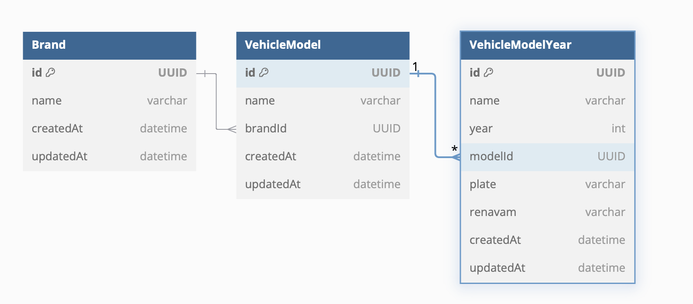

# Infosistemas Desafio Técnico

## Endpoints
  - (Documentação Swagger) `/api`
  - (GET/POST/PATCH/DELETE) `/brands`
  - (GET/POST/PATCH/DELETE) `/vehicle-model`
  - (GET/POST/PATCH/DELETE) `/vehicle-model-year`

  **Obs**: Existe um arquivo `.json` localizado em `/docs` com todos os endpoints disponíveis para importação no POSTMAN.

## Especificações do Servidor

## Versionamento
  NodeJS: v22
  NestJS: v10
  PrismaClient: v5.22
  Postgres: ^v17

### HTTP/HTTPS
  O servidor conta com diversas rotas RESTful. Além disso, há uma variável de ambiente chamada `SSL` (booleano) que define qual protocolo de comunicação será utilizado.

  **Importante**: Os certificados e chaves públicas e privadas são para uso exclusivo de conexão localhost. Não devem e não serão utilizados para ambiente de produção ou ambientes expostos.

### Banco de Dados
  O servidor se conecta a um banco de dados **PostgreSQL**. Considerando o caráter da aplicação, o banco foi escolhido por sua consistência nos dados, além da estrutura SQL ser ideal para as relações entre as tabelas.

  A variável de ambiente para sua conexão é `DATABASE_URL`, que deve seguir o formato **URI PostgreSQL**.

  Tanto o histórico de alterações no banco de dados quanto novas mudanças devem ser devidamente feitas e documentadas nos arquivos de migrações localizados em `/prisma/migrations` e no arquivo `/prisma/schema.prisma`.

  Para facilitar o ambiente de desenvolvimento, há um arquivo `docker-compose.yml` com um PostgreSQL configurado.

  Abaixo está o diagrama do banco de dados:  
  

### Pontos de Melhoria
  - É perceptível que o código carece de um sistema de autenticação e autorização para os métodos.
  - Automação de ferramentas para manter a qualidade do código, como pre-commit ou pre-push.
  - Sistema automatizado de CD (Continuous Delivery).

## Utilização do Programa

### Ambiente de Desenvolvimento (Linux/macOS)
  - Baixar as dependências:  
    ```bash
    npm install
    ```
  - Iniciar o banco de dados local:  
    ```bash
    docker compose up -d
    ```
  - Gerar o arquivo `.env`:  
    ```bash
    cp .env.example .env
    ```
  - Caso o servidor deva ser executado em HTTPS, a variável de ambiente `SSL` deve estar configurada como `true`, e os certificados devem ser gerados com o comando:  
    ```bash
    npm run cert:ssl:generate
    ```
  - Executar as migrações no banco de dados:  
    ```bash
    npm run migrate:dev
    ```
  - Iniciar o servidor:  
    ```bash
    npm run start
    ```

### Ambiente de Desenvolvimento (Windows)
  - Baixar as dependências:  
    ```cmd
    npm install
    ```
  - Iniciar o banco de dados local:  
    ```cmd
    docker-compose up -d
    ```
  - Gerar o arquivo `.env`:  
    ```cmd
    copy .env.example .env
    ```
  - Caso o servidor deva ser executado em HTTPS, a variável de ambiente `SSL` deve estar configurada como `true`, e os certificados devem ser gerados com o comando:  
    ```cmd
    npm run cert:ssl:generate
    ```
  - Executar as migrações no banco de dados:  
    ```cmd
    npm run migrate:dev
    ```
  - Iniciar o servidor:  
    ```cmd
    npm run start
    ```

## Overview Pessoal do Desafio

### Opinião do Desenvolvedor
  Gostei bastante do desafio. O fato de ser aberto à escolha do candidato deixa tudo mais interessante.

### Dificuldade de Desenvolvimento
  Os requisitos obrigatórios não foram muito desafiadores, porém a utilização do `Mocha` como ferramenta de testes unitários gerou erros de compatibilidade com o TypeScript, mesmo utilizando o `ts-node`. Como não tive muito tempo para investigar o problema em baixo nível, optei por escrever os testes unitários utilizando `Jest`, já que é a ferramenta recomendada pela documentação do framework `NestJS` (referência à documentação [aqui](https://docs.nestjs.com/fundamentals/testing)).

### Pontos Extras
  - A existência de testes somente para arquivos de serviços é intencional para separar os testes unitários (exigência obrigatória do desafio) dos testes de integração ou end-to-end (E2E). Controllers e rotas HTTP não possuem cobertura de testes, apenas funções de serviços, as quais contêm a lógica de negócios e conexões com o banco de dados.
  
  - Não há alterações diretas de relacionamentos pela API. Isso se deve à forma como o banco de dados foi projetado. Todas as relações são 1:N com **onCascade**. A única maneira de alterar um relacionamento é pelos métodos PATCH, onde é possível alterar o ID da relação pai (BRAND -> VEHICLE_MODEL -> VEHICLE_MODEL_YEAR).
